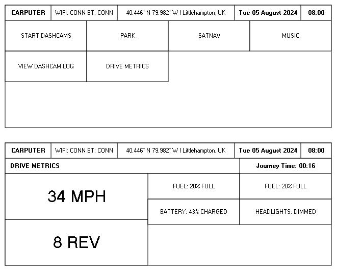

# Carputer

An onboard computer for my Volkswagen Fox created with Raspberry Pi.

## Dashboard

### Rough design

## TODO

- What is the equivalent of NPM scripts and `npm run start`, is there a
  convention in Python for running an app locally?

  - Should this supplant or be used alongside a Makefile?

- How will the individual microservices (dashcam, map etc) be invoked from the
  main Dashboard?

- Is it possible to embed third-party applications (Spotify, Google Maps etc)
  within a `tkinter` frame, to maintain the same styling?
